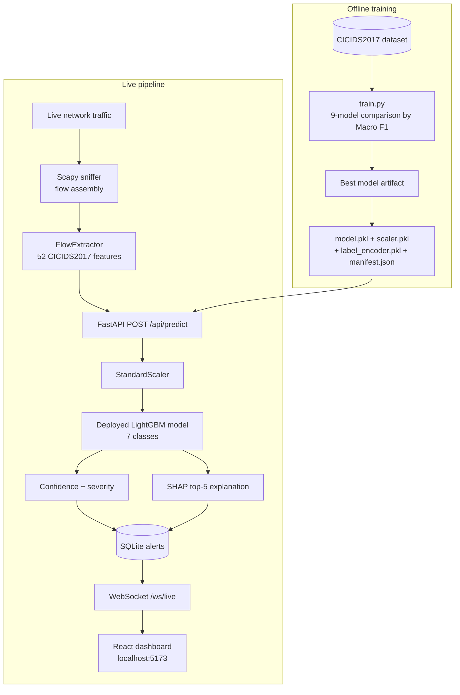

# The Sentinel — Network Intrusion Detection System

> A real-time, ML-powered NIDS: captures network traffic, reconstructs flows, classifies threats from the CICIDS2017 taxonomy, explains every detection with SHAP, and streams alerts to a live React command-center dashboard.

[](https://python.org)
[](https://fastapi.tiangolo.com)
[](https://react.dev)
[](https://typescriptlang.org)
[](https://vite.dev)
[](https://scikit-learn.org)
[](https://lightgbm.readthedocs.io)
[](https://shap.readthedocs.io)
[](LICENSE)

**[Documentation](#documentation) · [API Reference](#api-reference) · [Running Tests](#running-tests)**

---

## Table of Contents

- [About](#about)
- [Features](#features)
- [Tech Stack](#tech-stack)
- [Architecture](#architecture)
- [Getting Started](#getting-started)
  - [Prerequisites](#prerequisites)
  - [Installation](#installation)
  - [Environment Variables](#environment-variables)
- [Usage](#usage)
- [Dashboard](#dashboard)
- [ML Pipeline](#ml-pipeline)
- [Detection Classes](#detection-classes)
- [Feature Extraction](#feature-extraction)
- [API Reference](#api-reference)
- [Running Tests](#running-tests)
- [Security](#security)
- [Project Structure](#project-structure)
- [Limitations](#limitations)
- [Roadmap](#roadmap)
- [Documentation](#documentation)
- [Contributing](#contributing)
- [License](#license)
- [Acknowledgements](#acknowledgements)

---

## About

Most intrusion detection falls into two camps: signature-based systems that miss novel attacks, and black-box ML systems that flag traffic without explaining why. The Sentinel is designed to be neither. It captures packets live, reassembles them into bidirectional flows, extracts the same 52 features used by the CICIDS2017 benchmark, and classifies each flow with a deployed machine-learning model — then explains every detection with SHAP feature contributions and maps it to an operational severity level.

The system is end-to-end: a Scapy-based sniffer feeds a FastAPI backend, predictions are persisted to SQLite, and attack alerts stream to a React dashboard over WebSocket in real time. Because every alert carries its top contributing features, an analyst can see *why* a flow was flagged, not just that it was flagged.

It is aimed at security students, researchers, and demo teams who need a self-contained platform — capture, detection, explanation, visualization, and attack simulation all running on a single machine without a real adversary. Scripted attack simulators (DDoS, port scan, brute force) let you validate the whole pipeline safely on loopback. A Gemini-powered chat assistant can answer natural-language questions about the live alert data.

> The bundled `nids.db` already contains roughly 2,000 labeled flows from demo runs, so the dashboard shows real data the moment the backend starts.

---

## Features

- **Real-time network monitoring** — live packet capture with Scapy, automatic interface detection (Npcap-aware on Windows), and bidirectional flow assembly using a 5-tuple key `(src_ip, dst_ip, src_port, dst_port, protocol)`.
- **ML-based classification** — production inference against the deployed LightGBM artifact, with `predict_proba` confidence.
- **CICIDS-compatible features** — exactly 52 flow-level features matching the CICIDS2017 schema (packet statistics, rates, inter-arrival times, TCP flags, window sizes, active/idle periods).
- **Explainable detection** — cached SHAP `TreeExplainer` returns the top-5 contributing features for every non-benign alert, with signed values.
- **Severity classification** — CRITICAL / HIGH / MEDIUM / LOW / NONE derived from the predicted class via a curated mapping.
- **Live alert streaming** — FastAPI WebSockets push attack alerts to every connected dashboard within milliseconds of inference.
- **Security dashboard** — KPI cards, live traffic chart, attack-distribution pie, alert feed, attacker leaderboard, and a 12-hour attack timeline.
- **Alert archive** — paginated, filterable, searchable historical alerts with one-click CSV export.
- **Network activity view** — real source-to-destination flow aggregation built from the stored alert data.
- **SHAP explainability page** — pick any alert and inspect its feature contributions, with deep links.
- **System status page** — backend health, deployed-model manifest, sniffer counters, and security flags.
- **AI assistant** — LangChain + Google Gemini chatbot grounded in the alerts database (requires a Gemini API key).
- **Attack simulation** — DDoS, port-scan, and brute-force generators, plus a mixed scenario runner, for safe demos on local targets.
- **Dataset replay** — `send_attacks.py` replays balanced attack samples from the CICIDS2017 CSV through the live API.
- **Automated tests** — 32 backend tests (pytest) and 17 frontend specs (vitest + Testing Library).

---

## Tech Stack

| Layer | Technology |
|---|---|
| Frontend | React 18, TypeScript, Vite 7, Tailwind CSS + shadcn/ui, Recharts, TanStack Query, React Router, Axios |
| Backend | Python 3.10+, FastAPI 0.110, SQLAlchemy 2.0, Uvicorn, Scapy 2.5 |
| ML / data | scikit-learn 1.4, LightGBM (deployed model), XGBoost, SHAP 0.45, joblib, imbalanced-learn, pandas, NumPy |
| Database | SQLite (default, zero-config) · PostgreSQL supported via `DATABASE_URL` (exercised only in config) |
| AI assistant | LangChain + Google Gemini (`gemini-2.5-flash` by default) |
| Testing | pytest + httpx (backend) · vitest + Testing Library + jsdom (frontend) |

---

## Architecture



**Live path:** packets captured on an interface are grouped into flows; completed flows are converted to 52 features and POSTed to `/api/predict`. The backend scales the vector, classifies it, computes confidence and severity, explains it with SHAP, persists an alert row, and — if it is an attack — pushes it to all dashboards over WebSocket.

**Offline path:** `src/model/train.py` trains and compares 9 model families on the cleaned CICIDS2017 dataset and saves the best-by-Macro-F1 artifact, which the running API loads lazily at startup.

---

## Getting Started

### Prerequisites

- **Python 3.10+** (developed and tested on 3.11)
- **Node.js 20+** — Vite 7 requires a recent Node release; npm comes with it
- **Packet capture privileges** — the sniffer and simulators need admin/root rights to send and receive raw packets; on Windows, Scapy requires **Npcap** (auto-detected, with a Layer-3 fallback when missing)
- **Google Gemini API key** — only if you want to use the chatbot (`/api/chat` returns 503 without it)
- No Docker, no external database, no internet connection needed for the core pipeline

### Installation

**Backend**

```bash
cd nids-backend
python -m venv .venv

# Windows
.\.venv\Scripts\activate
# macOS / Linux
source .venv/bin/activate

pip install -r requirements.txt
```

Optional sanity check of the shipped ML artifacts (also writes `manifest.json`):

```bash
python check.py
```

**Frontend**

```bash
cd nids-frontend
npm install
```

### Environment Variables

Copy `nids-backend/.env.example` to `nids-backend/.env` and set values as needed:

| Variable | Required | Default | Description |
|---|---|---|---|
| `GOOGLE_API_KEY` | only for chatbot | — | Gemini API key used by `/api/chat` |
| `GEMINI_MODEL` | no | `gemini-2.5-flash` | Gemini model name for the chatbot |
| `DATABASE_URL` | no | `sqlite:///./nids.db` | SQLAlchemy connection string (PostgreSQL supported in config) |
| `NIDS_API_SECRET` | no | empty | If set, all `/api/*` requests must send `X-API-Key: <value>` |
| `NIDS_RATE_LIMIT` | no | `120` | Per-IP request limit per minute (HTTP 429 beyond) |
| `NIDS_CAPTURE` | no | `0` | `1`/`true`/`yes` auto-starts the sniffer at backend startup |

```env
GOOGLE_API_KEY=your_key_here
```

> Never commit a real `.env` — it is gitignored, as are model artifacts (`*.pkl`), databases (`*.db`), raw data (`data/`), and demo reports.

---

## Usage

### Minimal happy path

1. **Terminal 1 — backend**

   ```bash
   cd nids-backend
   .\.venv\Scripts\activate        # or: source .venv/bin/activate
   uvicorn src.api.main:app --reload --port 8000
   ```

2. **Terminal 2 — frontend**

   ```bash
   cd nids-frontend
   npm run dev
   ```
   Open `http://localhost:5173` — the dashboard starts showing data immediately (the bundled demo database already contains ~2,000 flows).

3. **Verify the API** — `http://localhost:8000/health` should return `{"status": "ok", "db": "ok", "model": "ok", ...}`. Interactive docs live at `http://localhost:8000/docs`.

4. **Start live capture** (admin/root shell; Npcap on Windows)

   ```bash
   cd nids-backend
   python src/capture/sniffer.py --interface auto
   ```
   or via the API: `POST /api/sniffer/start` (optionally `{"interface": "Wi-Fi"}`).

5. **Generate controlled attack traffic** (second admin/root shell; targets loopback by default)

   ```bash
   cd nids-backend
   python src/simulation/sim_mixed.py          # DDoS → port scan → SSH brute force in sequence
   # individual generators:
   python src/simulation/sim_ddos.py
   python src/simulation/sim_portscan.py
   python src/simulation/sim_bruteforce.py
   ```

6. **Watch it work** — within seconds the alert feed lights up with DDoS / Port Scanning / Brute Force alerts; open `/explain` to inspect SHAP explanations, `/network` for source-destination aggregation, `/reports` for attack distribution, and `/settings` for live system status.

### Offline replay (no raw sockets needed)

If `nids-backend/data/raw/cicids2017_cleaned.csv` is present, replay balanced attack samples straight into the API:

```bash
cd nids-backend
python send_attacks.py
```

Keep replay runs rate-bounded — every row is persisted to the database.

---

## Dashboard

The frontend is a routed React app (no placeholder tabs). Every page has explicit loading, empty, and error states.

| Route | Page | Contents |
|---|---|---|
| `/` | Dashboard | KPI cards (flows, attacks, uptime, benign traffic), live traffic chart, attack-type pie, live alert feed, attacker leaderboard, 12-hour attack timeline |
| `/alerts` | Alert archive | Paginated, filterable (type / severity / free text), searchable history with CSV export of the current view |
| `/reports` | Reports | Attack distribution, leaderboard, and timeline in a consolidated view |
| `/network` | Network activity | Real source-to-destination flow aggregation (counts, volume bars, attack types, max severity) from the latest 500 alerts |
| `/explain` | Explainability | Alert picker + SHAP top-5 bars per alert; deep links via `?src=&t=` |
| `/settings` | System status | Backend health, deployed-model manifest, sniffer counters (incl. retries/dropped), security flags — live refresh |

The floating **Sentinel AI** chatbot answers natural-language questions about stats, top attackers, and recent alerts; chat responses are sanitized (HTML-escaped before rendering) and input is capped at 2000 characters.

---

## ML Pipeline

**Dataset** — The deployed model is trained on the **CICIDS2017** cleaned dataset (`2,520,751 rows × 53 columns`, label column `Attack Type`, consolidated into 7 classes). The raw CSV stays in `nids-backend/data/raw/` (gitignored).

**Training** (`python src/model/train.py`):

1. Chunked, per-class stratified loading (targets ~400,000 rows).
2. Cleaning: inf → NaN, drop NaN, drop duplicates.
3. Optional 7 engineered ratio features — **comparison only**, never used in production (inference/SHAP consistency is kept on the 52-feature contract).
4. Label encoding → `label_encoder.pkl`; stratified 80/20 train/test split (`random_state=42`), holdout arrays persisted to `data/processed/`.
5. Dual scalers fit on training data — StandardScaler and RobustScaler; production inference uses the StandardScaler (`scaler.pkl`).
6. Class imbalance handled with `class_weight="balanced"` (SMOTE present but disabled).
7. PCA experiment at 90/95/99% variance — **evaluated, deliberately not deployed** (SHAP needs original features).
8. **9-model comparison**: Logistic Regression, Decision Tree (grid search), Random Forest (randomized search), XGBoost, LightGBM, SVM-RBF (15k subset), MLP neural net, Voting ensemble, Stacking ensemble — ranked by **Macro F1** (5-fold stratified CV on the top 2).
9. Best model auto-saved to `model.pkl`; `python check.py` verifies artifact consistency and writes a machine-readable `manifest.json`.

**Deployed artifact** (verified `manifest.json`): `LGBMClassifier` trained on **52 features** with a `LabelEncoder` over **7 classes** and 21 severity-map keys. SHAP inference runs through a cached `TreeExplainer`.

> Exact benchmark metrics of the saved artifact are not embedded in the repository. Regenerate them by running the training and evaluation pipeline (`train.py`, `evaluate.py`, notebooks).

---

## Detection Classes

The deployed model outputs exactly these 7 classes (from `label_encoder.pkl` / `manifest.json`):

| Class | Typical severity |
|---|---|
| `Normal Traffic` | NONE |
| `Bots` | HIGH |
| `Brute Force` | LOW |
| `DDoS` | CRITICAL |
| `DoS` | CRITICAL |
| `Port Scanning` | MEDIUM |
| `Web Attacks` | MEDIUM |

Severity is assigned by lowercase substring rules in `src/model/predict.py` (`SEVERITY_MAP`); unmatched predictions fall back to LOW. Richer CICIDS2017 labels (e.g., FTP-Patator, SSH-Patator, DoS Hulk, Infiltration, Heartbleed) exist in the dataset taxonomy and remain covered by the severity map, but they are **not** independently predicted by the deployed artifact.

> **Benign semantics:** the model's benign class is `Normal Traffic`, not `"BENIGN"`. All stats, feeds, and broadcast logic share one constant — `BENIGN_LABELS = ("Normal Traffic", "BENIGN")` in `src/api/constants.py` — so the two spellings can never again be miscounted (this was a fixed historical bug).

---

## Feature Extraction

`FlowExtractor` (`src/features/extractor.py`) converts a flow's packet list into the exact 52-key, CICIDS2017-named vector the model expects, in fixed order:

- **Packet statistics** — min/max/mean/std/variance of packet lengths, average packet size, per-direction totals
- **Flow rates** — bytes/s and packets/s, forward/backward packet rates (zero-duration protected)
- **Temporal features** — flow duration, IATs (mean/std/max/min for flow and per direction) in microseconds
- **Protocol features** — TCP flag counts (FIN/PSH/ACK), header lengths, initial window sizes, active/idle periods via a 5-second activity threshold
- **Guarantees** — NaN/Inf always coerced to `0.0`; the 52-name list in one place (`CICIDS_FEATURES`) with runtime parity guards against the model's `n_features_in_`

---

## API Reference

REST base: `http://localhost:8000`. Interactive docs: `http://localhost:8000/docs` (OpenAPI).

| Method | Endpoint | Purpose | Auth |
|---|---|---|---|
| POST | `/api/predict` | Classify one flow. Body: flat JSON with the 52 CICIDS feature names (+ optional `_source_ip`, `_destination_ip`, `_src_port`, `_dst_port` metadata). Returns prediction, confidence, severity, SHAP top-5, alert id. Strict validation: 400 if no feature keys; 422 if any value is non-numeric/non-finite/negative/>1e15 or more than 8 of 52 are missing (invalid features named) — no silent coercion; ports clamped to 0–65535 | `X-API-Key` if secret set |
| GET | `/api/alerts` | Paginated alert history (`limit` 1–500, `offset`), filters: `type`, `severity`, `exclude_benign` (default true) | `X-API-Key` if secret set |
| GET | `/api/stats` | `total_flows`, `total_attacks`, `benign_count`, `attacks_by_type`, `attacks_by_severity`, `uptime_seconds` | `X-API-Key` if secret set |
| GET | `/api/ip-leaderboard` | Top N attacking source IPs by count, with last-seen (`limit`, default 10) | `X-API-Key` if secret set |
| POST | `/api/chat` | Chat with Sentinel AI (`{message, history[]}`). 2000-char cap, 60 s LLM timeout, bounded history; 503 without `GOOGLE_API_KEY` | `X-API-Key` if secret set |
| POST | `/api/sniffer/start` | Start packet capture (optional `interface`; `auto` detection) | `X-API-Key` if secret set |
| POST | `/api/sniffer/stop` | Stop capture and return final counters | `X-API-Key` if secret set |
| GET | `/api/sniffer/stats` | Interface + counters: packets, flows, API calls, alerts, retries, dropped | `X-API-Key` if secret set |
| GET | `/api/system` | Aggregated status: health + model manifest + sniffer stats + rate limit + API-key/NIDS_CAPTURE flags (powers the Settings page) | `X-API-Key` if secret set |
| GET | `/health` | Liveness: db, model, sniffer, uptime, WS client count | none |
| | | | |

**WebSocket — `ws://localhost:8000/ws/live`**

On connect it sends the last 50 attack alerts as one JSON batch, then pushes new attack alerts in real time, with a ping every 10 seconds. Session cleanup is guaranteed (`finally`-closed), so dropped clients never leak database sessions.

---

## Running Tests

**Backend** (from `nids-backend/`, venv active):

```bash
python -m pytest tests/ -q
```

32 tests, all passing — feature-extractor fixtures (normal / DDoS / port-scan), API tests via TestClient with a test SQLite DB, 52-feature-contract regression, benign-label (BENIGN_LABELS) regression, and DoS severity mapping. Integration scripts (`test_pipeline.py` in-process; `test_api.py`, `test2_api.py` against a live server) live at the backend root.

**Frontend** (from `nids-frontend/`):

```bash
npm test          # vitest — 17 specs across 6 suites
npm run lint      # ESLint
npm run build     # type-check + production build (Vite)
```

Suites cover AlertFeed (rows, empty state, CSV export, links), AttackTimeline (real `bucketByHour` bucketing, no synthetic rows), Chatbot markdown sanitization, Sidebar (routes, real export, no placeholders), StatusBar health states, and the Settings page.

---

## Security

Implemented:

- **Optional API-key auth** — when `NIDS_API_SECRET` is set, every `/api/*` call must present `X-API-Key` (401 otherwise). Middleware-level, not user authentication.
- **Rate limiting** — per-IP, configurable (`NIDS_RATE_LIMIT`, default 120/min, 429 beyond).
- **Strict prediction validation** — malformed or incomplete feature vectors are rejected with named invalid features; nothing is silently coerced.
- **Chatbot hardening** — 2000-char message cap (schema + route), 60 s LLM timeout, bounded history, system prompt that declines out-of-scope requests and never fabricates statistics.
- **Output sanitization** — all chat/LLM HTML is escaped before markdown rendering (no raw HTML reaches the DOM).
- **Secrets & artifacts** — `.env`, model artifacts (`*.pkl`), databases (`*.db`), raw data, and demo reports are gitignored.
- **CORS** — restricted to the documented local dev origins (`localhost:3000/5173/8080/5174`). CORS is a browser policy, **not** authentication.
- **Simulation safety** — all simulators default to loopback targets; they must never be pointed at external hosts.

Remaining limitations are listed in [Limitations](#limitations).

---

## Project Structure

```text
nids/
├── README.md                     ← you are here
├── docs/
│   ├── NIDS_PRD.md                   ← product requirements (what & why)
│   ├── NIDS_TechSpec.md              ← technical specification (how)
│   ├── NIDS_AppFlow.md               ← application flows, step by step
│   ├── NIDS_Design.md                ← UI/UX design spec
│   ├── NIDS_Schema.md                ← database schema & artifacts
│   ├── NIDS_ImplementationPlan.md    ← build plan mapped to the repo
│   ├── NIDS_Tracker.md               ← task tracker with status rollup
│   └── NIDS_Rules.md                 ← development rules & standards
│
├── nids-backend/
│   ├── src/
│   │   ├── api/                  ← FastAPI app (main.py, routes/, models, schemas, constants)
│   │   ├── capture/              ← Scapy sniffer (flow assembly, retries)
│   │   ├── features/             ← 52-feature CICIDS2017 extractor
│   │   ├── model/                ← train.py, predict.py, evaluate.py
│   │   └── simulation/           ← sim_ddos / sim_portscan / sim_bruteforce / sim_mixed
│   ├── data/                     ← raw dataset & processed holdouts (gitignored)
│   ├── notebooks/                ← EDA + training notebooks
│   ├── tests/                    ← pytest suite
│   ├── model.pkl / scaler.pkl / label_encoder.pkl / manifest.json
│   ├── nids.db                   ← runtime SQLite database
│   ├── check.py · send_attacks.py
│   └── requirements.txt
│
└── nids-frontend/
    ├── src/
    │   ├── pages/                ← Index, Alerts, Reports, NetworkActivity, Explainability, Settings
    │   ├── components/           ← charts, feed, sidebar, status bar, chatbot (+ __tests__)
    │   ├── api/                  ← axios client
    │   ├── hooks/                ← useWebSocket, etc.
    │   └── test/                 ← vitest setup
    └── package.json
```

---

## Limitations

- **No user authentication/authorization or TLS** — the optional `X-API-Key` and rate limiting are defence-in-depth, not full access control; the project is not a hardened public deployment.
- **PostgreSQL is configurable but not exercised** — all repository evidence uses SQLite.
- **No distributed streaming stack** — Redis/Kafka are listed in requirements but unused; in-memory flow tables + synchronous SQLite writes suit single-host demo/research scale.
- **No live topology graph** — `/network` aggregates flows into tables; a graph visualization is future work.
- **No Alembic migrations** — schema is created via `create_all()`; schema changes need manual DDL or a DB recreate.
- **No Playwright E2E tests yet** — frontend coverage is unit-level (vitest).
- **Exact saved-artifact benchmarks are unavailable** — regenerate via `train.py` / `evaluate.py` (see [ML Pipeline](#ml-pipeline)).
- **Notebook nits** — EDA/training notebooks print `Label column: None` because they search for the literal `"label"` while the CSV uses `Attack Type` (production `train.py` handles this correctly); `evaluate.py` assumes benign class index 0 (class 0 is `Bots`) — offline-only, not in the production path.
- **Operational**: the Gemini key in a local `.env` should be rotated; packet capture requires admin/root privileges.

---

## Roadmap

**Completed**

- End-to-end pipeline: capture → extract → classify → explain → persist → stream → visualize
- Benign-label alignment (`BENIGN_LABELS` single source of truth, HISTORICAL ISSUE-01 fixed)
- Strict prediction validation, chatbot hardening, output sanitization
- Sniffer delivery hardening (retry/backoff, drop counters), `GET /api/system`
- Real settings page, network activity page, explainability page, alert archive with CSV export
- Frontend test suites (17 specs) and document set synced to code

**Future** (tracked in `docs/NIDS_Tracker.md`)

- Full authentication/authorization + TLS-terminated deployment
- Live topology graph of aggregated flows
- Alembic migrations (schema versioning)
- Playwright E2E suites
- FPR benign-index fix (`evaluate.py`, ISSUE-06)
- Notebook label-detection cleanup (ISSUE-05)
- Experiment/model registry (mlflow/optuna) and automated retraining
- Stream-processing stack (Redis/Kafka) for larger deployments

---

## Documentation

The repository ships an 8-document set kept in sync with the code — see the [Project Structure](#project-structure) tree for locations.

| Document | What it covers |
|---|---|
| [NIDS_PRD.md](docs/NIDS_PRD.md) | Product requirements: vision, scope, functional & non-functional requirements, known issues |
| [NIDS_TechSpec.md](docs/NIDS_TechSpec.md) | Technical specification: stack, backend/frontend internals, API contract |
| [NIDS_AppFlow.md](docs/NIDS_AppFlow.md) | Application flows: startup, capture, inference, WebSocket, dashboard, simulators |
| [NIDS_Design.md](docs/NIDS_Design.md) | UI/UX design: layout, routes, components, styling system |
| [NIDS_Schema.md](docs/NIDS_Schema.md) | Database schema, data dictionary, non-DB artifacts |
| [NIDS_ImplementationPlan.md](docs/NIDS_ImplementationPlan.md) | Build plan (PH0–PH8) mapped to actual files |
| [NIDS_Tracker.md](docs/NIDS_Tracker.md) | Task tracker with per-phase status rollup (93 items: 84 done, 3 partial, 6 future) |
| [NIDS_Rules.md](docs/NIDS_Rules.md) | Development rules: security, data integrity, model governance, testing |

Historical material: [NIDS_AuditReport.md](docs/NIDS_AuditReport.md) (previous audit; fixes shipped since), `NIDS_Mid_Report.pdf`, `NIDS_Final_Report.pdf`, `VIVA_GUIDE.md`. Those reports describe the past state of the project — this README and the 8 docs describe the current one.

---

## Contributing

1. Fork the repository and create a branch for your work.
2. Follow the existing layout (backend modules under `src/`, pages/components under `nids-frontend/src/`) — see `docs/NIDS_Rules.md` (COD-* rules).
3. Validate before submitting:
   - Backend: `python -m pytest tests/ -q`
   - Frontend: `npm test`, `npm run lint`, `npm run build`
4. Keep the documentation synchronized — every new feature gets a `NIDS-XXX-NN` ID in `docs/NIDS_PRD.md` and a `PHx-NN` task in `docs/NIDS_ImplementationPlan.md` + `docs/NIDS_Tracker.md`; tick tasks when done.
5. Never commit secrets (`.env`, API keys), model artifacts, databases, or raw datasets — they are gitignored.
6. No placeholder or synthetic data in production paths; demos belong in `src/simulation`.

---

## License

Distributed under the [MIT License](LICENSE). Copyright (c) 2026 Abhinav.

---

## Acknowledgements

- **[CICIDS2017](https://www.unb.ca/cic/datasets/ids-2017.html)** — Canadian Institute for Cybersecurity benchmark dataset this project is trained on
- **[LightGBM](https://lightgbm.readthedocs.io)** — deployed classifier
- **[SHAP](https://shap.readthedocs.io)** — model explanations
- **[scikit-learn](https://scikit-learn.org)** — training, scaling, evaluation
- **[Scapy](https://scapy.net)** — packet capture and simulation
- **[FastAPI](https://fastapi.tiangolo.com)** — API + WebSocket backend
- **[React](https://react.dev), [Vite](https://vite.dev), [Tailwind CSS](https://tailwindcss.com), [shadcn/ui](https://ui.shadcn.com), [Recharts](https://recharts.org), [TanStack Query](https://tanstack.com/query)** — dashboard frontend
- **[LangChain](https://www.langchain.com) + Google Gemini** — chat assistant
- **[SQLAlchemy](https://www.sqlalchemy.org)** — persistence layer